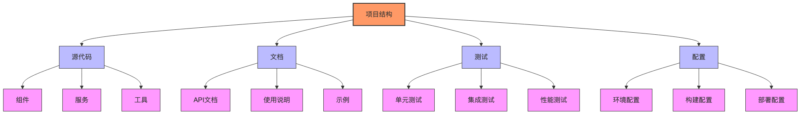
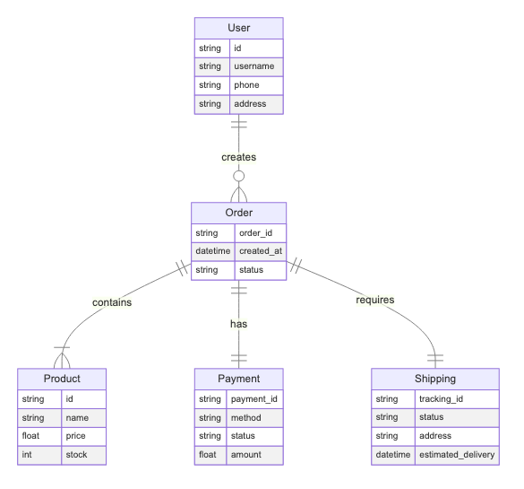
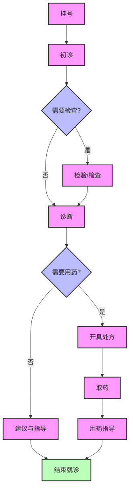

# Visual Flow AI - 智能流程图生成工具

<div align="center">
    <h3>项目结构图示例</h3>
    
    
    <h3>电商系统流程图示例</h3>
    
    
    <h3>医疗工作流程图示例</h3>
    
</div>

## 简介

Visual Flow AI 是一个基于 AI 的智能流程图生成工具，能够从文本描述自动生成各种专业图表。它使用 Zhipu AI 进行文本理解，并通过 Mermaid 生成高质量的可视化图表。

## 特性

- 🤖 智能文本解析
- 📊 多种图表类型支持
- 🎨 高清图表输出
- ⚙️ 可自定义配置
- 📝 简单的 Markdown 输入格式

## 图表类型

支持多种图表类型，包括：

1. **ER图** - 实体关系图
   <details>
   <summary>示例：电商系统</summary>
   
   </details>

2. **流程图** - 业务流程/工作流
   <details>
   <summary>示例：医疗流程</summary>
   
   </details>

3. **思维导图** - 结构化信息展示
   <details>
   <summary>示例：项目结构</summary>
   
   </details>

## 快速开始

### 安装

```bash
# 克隆项目
git clone [your-repository-url]
cd diagen

# 安装依赖
npm install
```

### 配置

创建 `.env` 文件并添加：
```env
ZHIPU_API_KEY=your_api_key_here
```

### 使用

1. 创建描述文件（Markdown 格式）：
```markdown
# 项目名称
## 模块
- 模块A
- 模块B
## 关系
- 模块A -> 模块B: 调用
```

2. 生成图表：
```bash
node generate_diagram.js your_file.md
```

3. 渲染图表：
```bash
node render_diagram.js
```

## 示例

查看 `examples` 目录获取更多示例：
- `examples/ecommerce.md` - 电商系统 ER 图
- `examples/medical_workflow.md` - 医疗流程图
- `examples/project_structure.md` - 项目结构图

## 配置选项

### Mermaid 配置 (mermaid-config.json)
```json
{
  "theme": "default",
  "themeVariables": {
    "fontSize": "16px"
  }
}
```

## 开发

### 项目结构
```
diagen/
├── src/              # 源代码
├── examples/         # 示例文件
│   ├── diagrams/    # 示例图表
│   └── *.md         # 示例数据
├── docs/            # 文档
└── test/           # 测试文件
```

### 构建
```bash
npm run build
```

### 测试
```bash
npm test
```

## 贡献指南

1. Fork 项目
2. 创建特性分支 (`git checkout -b feature/AmazingFeature`)
3. 提交更改 (`git commit -m 'Add some AmazingFeature'`)
4. 推送到分支 (`git push origin feature/AmazingFeature`)
5. 提交 Pull Request

## 许可证

MIT License - 查看 [LICENSE](LICENSE) 文件了解详情

## 致谢

- [Mermaid.js](https://mermaid-js.github.io/) - 图表渲染引擎
- [Zhipu AI](https://www.zhipuai.cn/) - AI 文本理解
